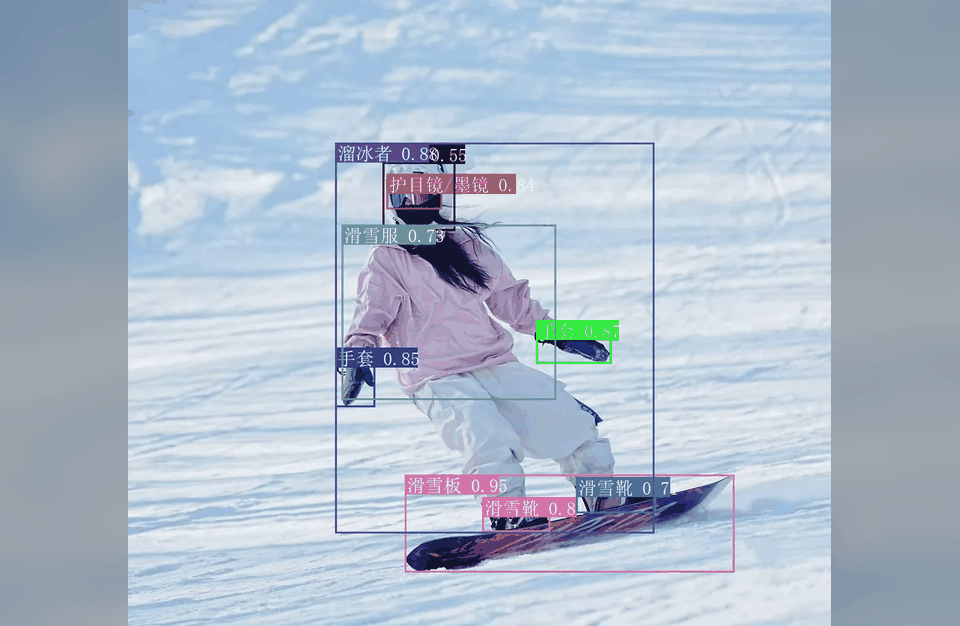
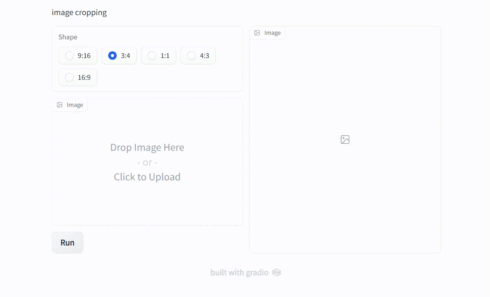
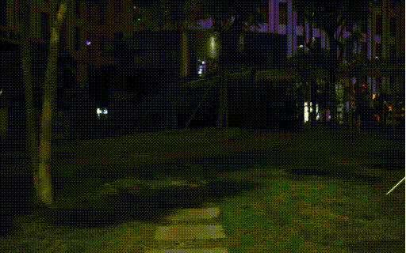

### [Open-World Recognition](https://openaccess.thecvf.com/content/CVPR2026/papers/Fu_WeDetect_Fast_Open-Vocabulary_Object_Detection_as_Retrieval_CVPR_2026_paper.pdf)

### [Smart Cropping](https://scholar.google.com/citations?view_op=view_citation&hl=zh-CN&user=O00rbxoAAAAJ&citation_for_view=O00rbxoAAAAJ:qUcmZB5y_30C)

### [Video Enhancement](https://www.sciencedirect.com/science/article/pii/S1077314223002965)

### [Video Surveillance](https://www.ecva.net/papers/eccv_2020/papers_ECCV/papers/123490069.pdf)

### [Video Tracking](https://arxiv.org/pdf/2308.15795)

